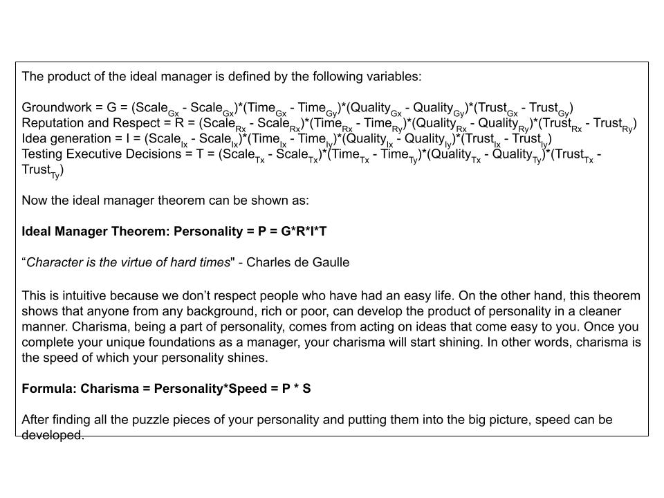
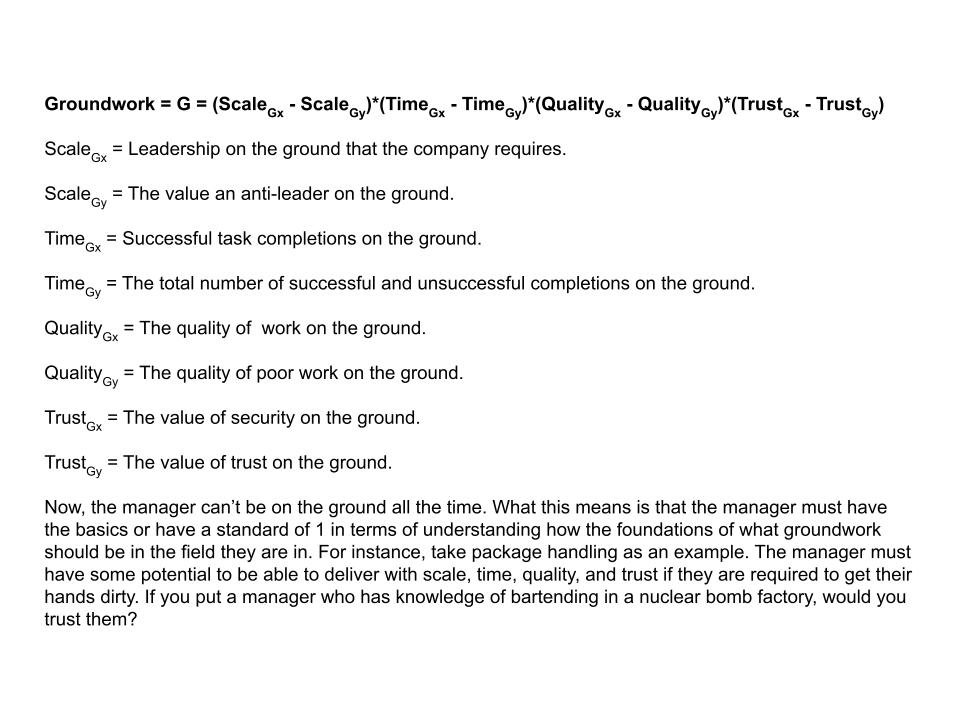
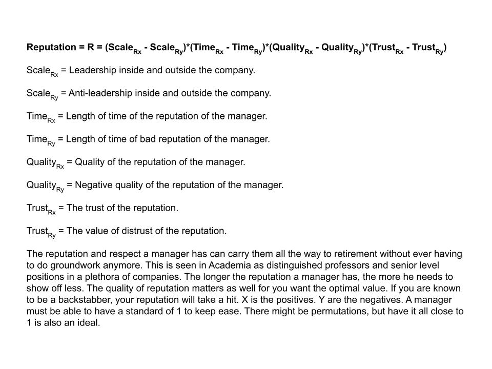
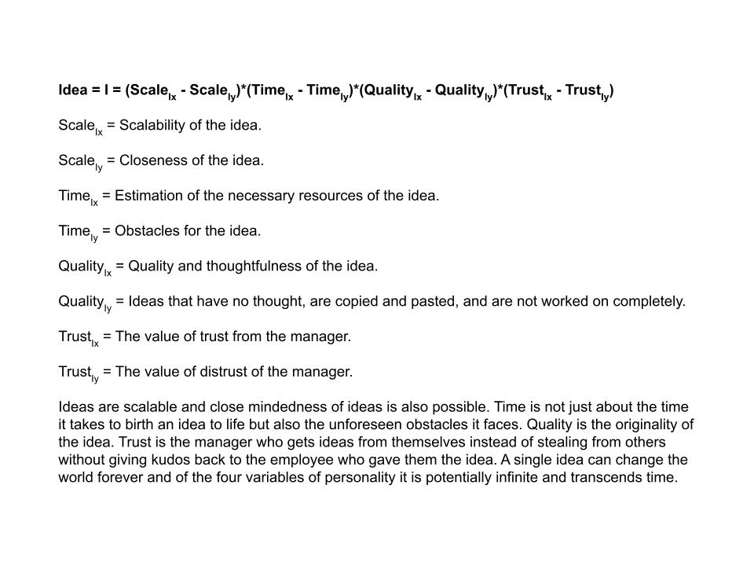
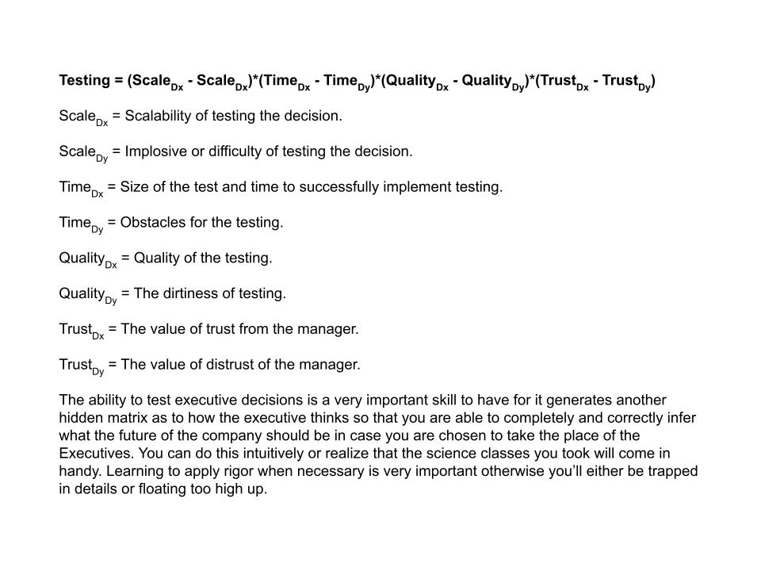
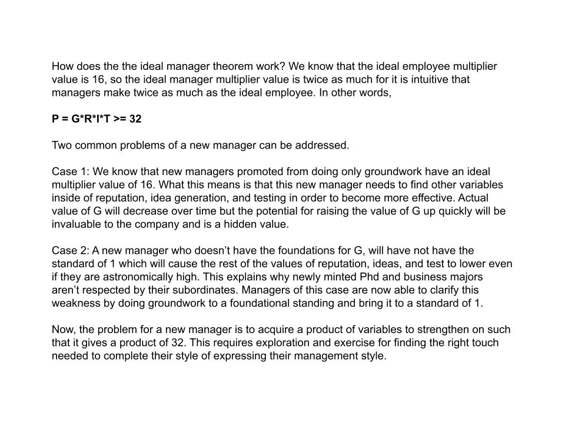
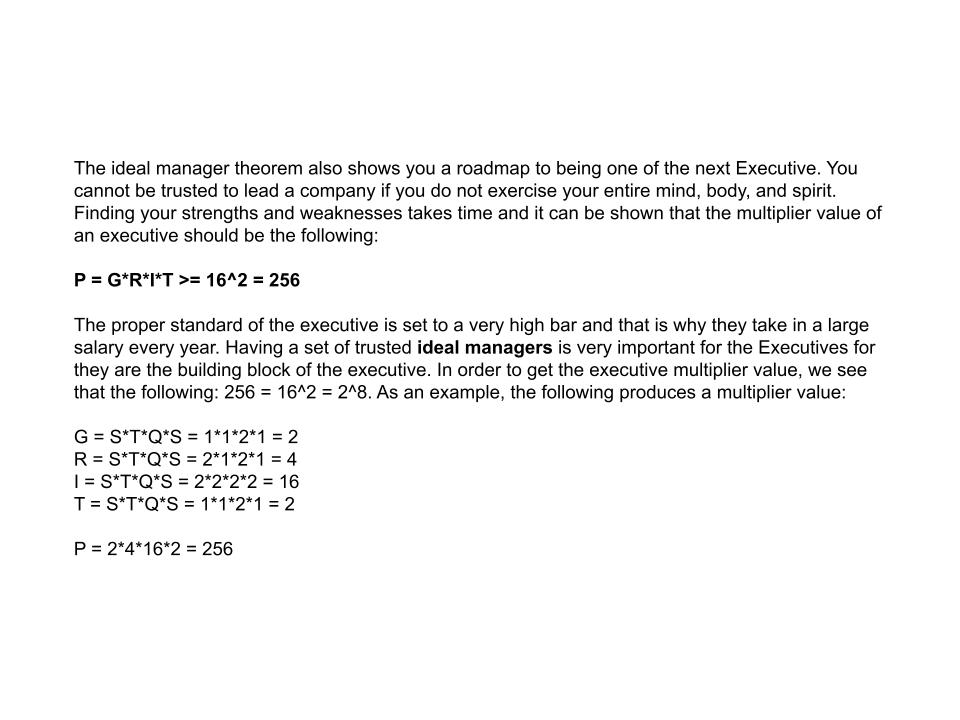

# Ideal Manager

Showing you the error of your ways.

### 1. Ideal Manager Theorem

### 2. Groundwork

### 3. Reputation And Respect

### 4. Ideas Generation And Creativity

### 5. Testing Executive Decisions

### 6. The Manager Multiplier

### 7. Conclusion

-----

# References

Ung, E. (2024). Analysis Of Bad Employees. https://github.com/ericung/AnalysisOfBadEmployees/tree/main

