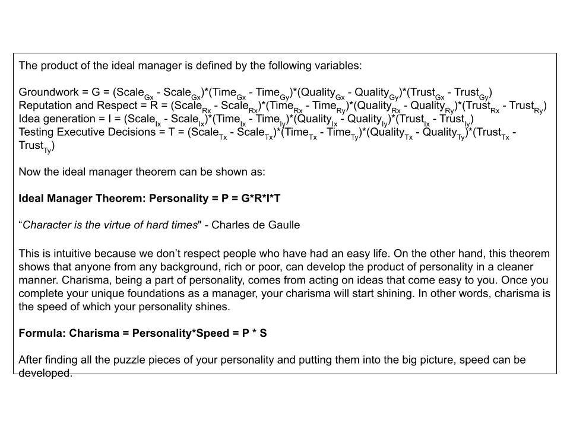
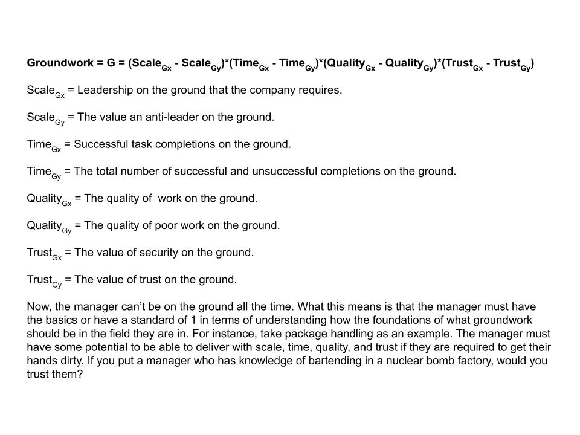
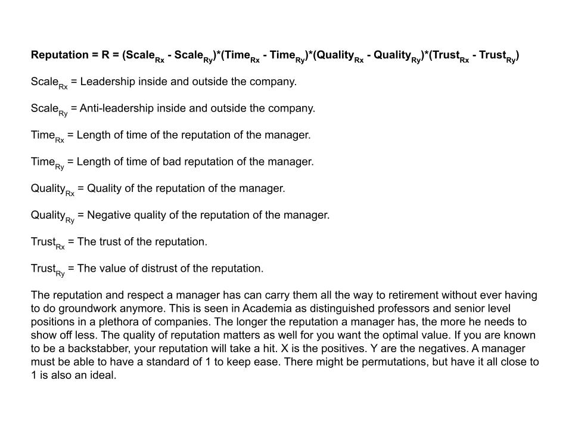
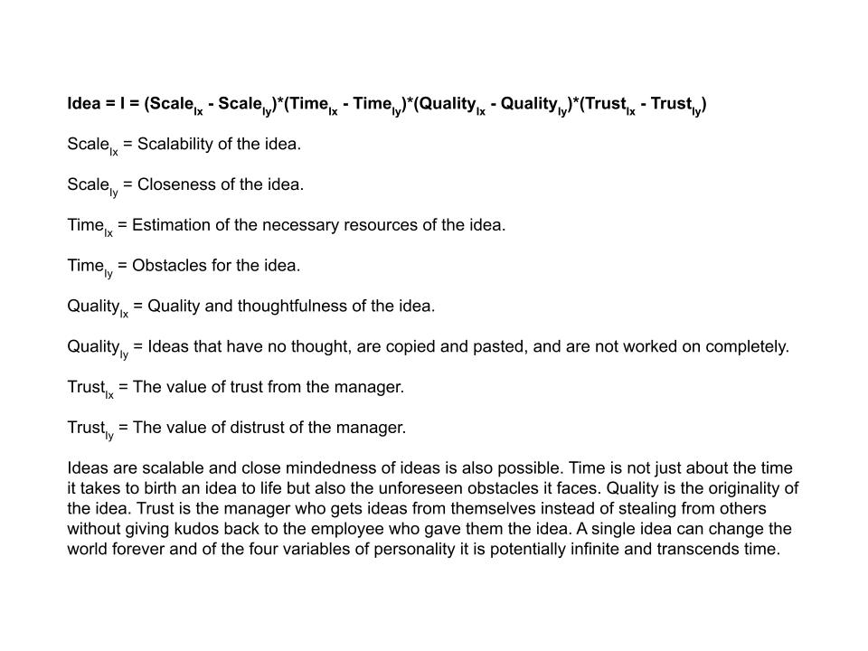
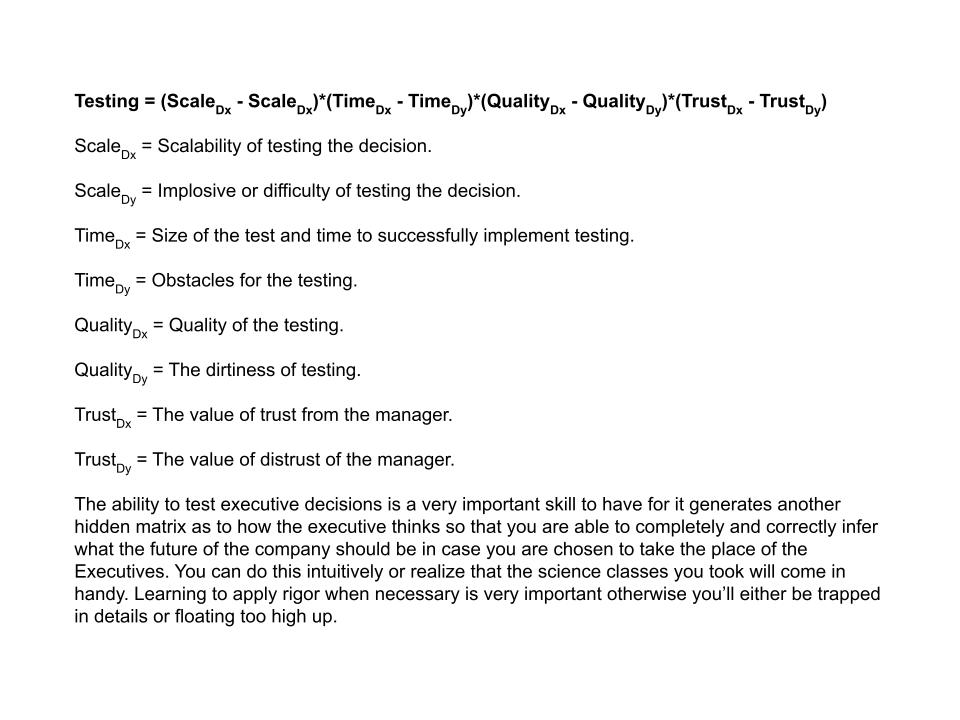
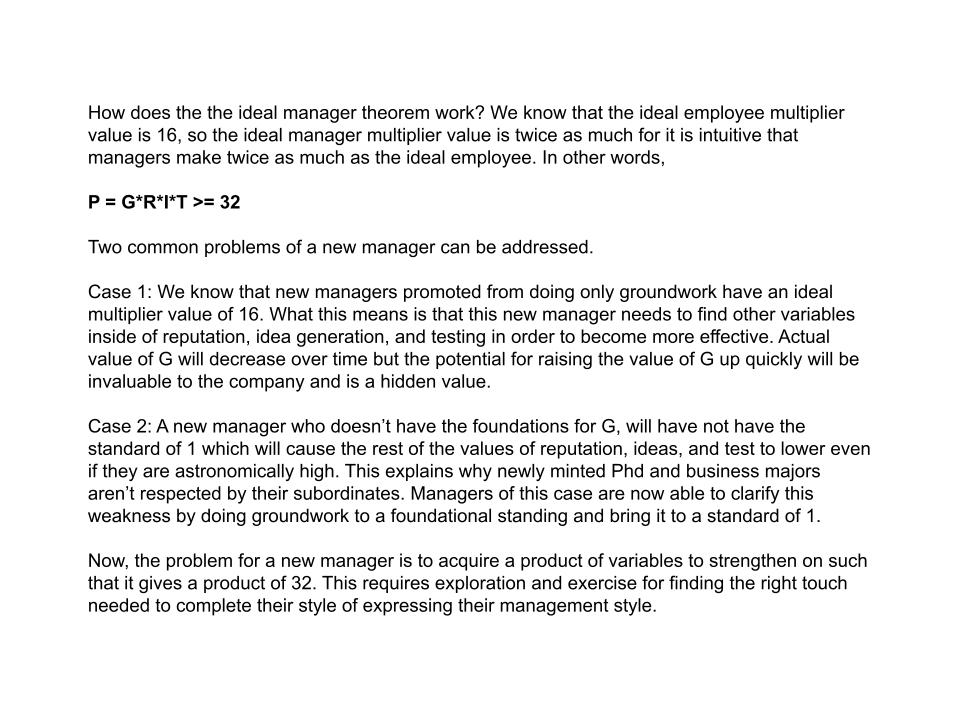
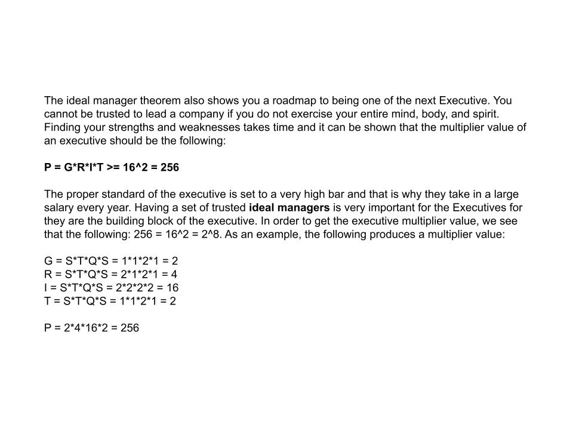

# Ideal Manager

Showing you the error of your ways.

### 1. Ideal Manager Theorem

### 2. Groundwork

### 3. Reputation And Respect

### 4. Ideas Generation And Creativity

### 5. Testing Executive Decisions

### 6. The Manager Multiplier

### 7. Conclusion

-----

# References

Fishbane, P. M., Gasiorowicz, S., & Thornton, S. T. (1996). Physics for scientists and engineers (3rd ed.). Prentice Hall.

Maxwell, J. C. (2007). The 21 irrefutable laws of leadership. Thomas Nelson.

Ung, E. (2024). Analysis Of Bad Employees. https://github.com/ericung/AnalysisOfBadEmployees/tree/main

Ung, E. (2024). Inferrable Languages. https://github.com/ericung/InferrableLanguages
